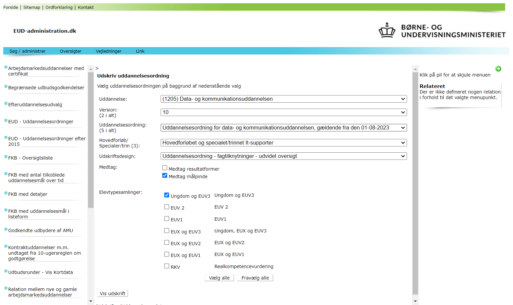

# Uddannelsesordnings pdf til MarkDown

Et forsøg på at hente målpinde for hvert fag fra uddannelsesadministrations elendige pdf'er.
Det skulle gerne være muligt at se en klarere oversigt, og ikke mindst kunne kopiere fra den.

_Der ligger færdige word- og md-filer i listen herover._

## __ANSVARSFRASKRIVELSE__

Dette er en uofficielt konvertering!  

* Der _kan_ mangle fag!
* Der _kan_ mangle mål!
* Mål og fag _kan_ være sammenblandede.
* Der _kan_ også mangle andre informationer om fag og mål.

Det er altid en god ide at kigge på pdf'en også, for lige at checke at alting er som det skal være :-)

## Anvendelse

1. Start på uddannelsesadministration.dk

    I en browser

2. Naviger

   1. vælg `Find EUD-uddannelsesordning`
   2. Udfyld felterne, efter dine behov. Det virker med de valg jeg har tastet her under:

3.  Download
    

4. Når du har hentet pdf'en fra uddannelsesadministration.dk, kan den konverteres til MarkDown med 

        python3 dump_tabula.py

    4.2. Men det er fedest at omdirigere stdout til en fil:

        python3 dump_tabula.py > allefag_prog_2023.md

5. MarkDown-filen kan så bruges direkte eller konverteres til f.eks. word, f.eks med `pandoc`:

        pandoc -i allefag_prog_2023.md -o allefag_prog_2023.docx

## Programkoden

Først parses pdf'en med __Tabula-py__.  
Fordi al teksten i pdf'en er inde tabeller, er det smart at bruge tabula-py. (Hmmm måske kunne man bare få alt teksen som tekst...?)  
Tabula-py returnerer en liste af Pandas DataFrames. Heraf er jeg kun intereseret i den første kolonne, og jeg trækker alle rækkerne i dataframes ud i en samlet liste, Bare en almindelig python liste. Listen kalder jeg `linies`, åbentlyst fordi hvert element i listen svarer til en linje tekst.  
Så fravælger jeg alle linjer der ikke er tekst (der er nogen linjer med tal...), og jeg fjerner side-toppene og nogen irriterende data.  
Så begynder det store `while`-loop som løber alle linjer igennem, og når en linje starter på "Fag; ", så er det starten på en beskrivelse af et fag.
Først kommer 8 linjer med skemadat for faget. 7 af linjerne (den 8. ("Tilknytningsperiode") er fjernet ovenfor) udtrækker jeg i strukturen `head` (pt. en liste).
Så følger et indre loop, som gentages så længe linjen _ikke_ starter med "Fag: ", her samles linjer der begynder med et tal op i listen `f_learn_objectives`.
Både `head` og `f_learn_objectives` samles i en _dictionary_ og tilføjes listen `fag`.  

Listen `fag` gennemløbes så for at formatere disse som markdown.

## Afhængigheder

kør

    pip install -r .\requirements.txt

Man skal have Java installeret, så på linux kan du køre:

    sudo apt install openjdk-19-jre-headless

Jeg kører scriptet i wsl2/ubuntu.

## Todo

* [ ] Pæne og håndterbare funktioner
* [ ] VSCode remote wsl projekt
* [ ] unittest
* [ ] valgt speciale i Titel
* [ ] Http request som selv henter pdf'erne
   * [ ] årligt
* [ ] diff på tidligere år
* [ ] Indfang overskrifter i tekst
  * [ ] kommer pt ind i mål :-(
* [ ] Alle uddannelser og varianter og versioner i database til analyse og versionsstyring
* [ ] ... 

## Kilder

* <https://www.eud.uddannelsesadministration.dk/>
* <https://github.com/chezou/tabula-py>
* <https://tabula-py.readthedocs.io/en/latest/index.html>

Tidligere kiggede jeg også på disse python libraries:

* <https://www.freecodecamp.org/news/extract-data-from-pdf-files-with-python/>
* <https://medium.com/@umerfarooq_26378/python-for-pdf-ef0fac2808b0>
* <https://github.com/atlanhq/camelot>
